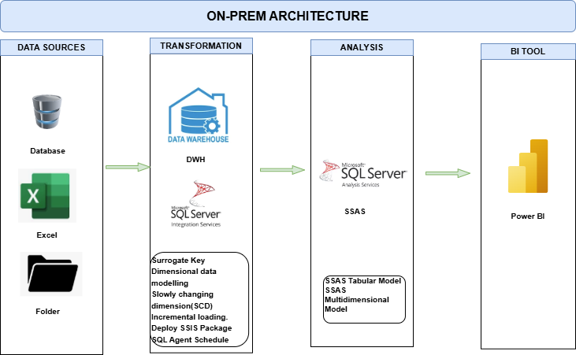

# On-premise-datawarehouse
A guide to building on-premise data warehouse with SQL Server, SSIS package, SSAS, Multidimensional, data marts, data modelling and integrate with BI tool.

## Project Overview

This project involves:

1. **Data Architecture**: Designing on-prem Data Warehouse Using **Data sources**, **Transform**, **Analyse**, and **BI** layers on SSIS and SSAS.
2. **ETL Pipelines**: Extracting, transforming, and loading data from source systems to Data warehouse, deploy SSIS Package, and schedule Agent jobs.
3. **Data Modeling**: Developing fact and dimension tables optimized for analytical queries with data mart.
4. **Analytics & Reporting**: Creating SQL-based reports and dashboards for actionable insights on Microsoft Power BI

## Architecture

The architecture for this project follows Medallion Architecture **Data sources**, **Transform**, **Analyse**, and **BI** layers:

## Resources
1. **SQL Server**: https://www.microsoft.com/en-us/sql-server/developer-tools
2. **SSIS Packages**: https://learn.microsoft.com/en-us/sql/integration-services/integration-services-ssis-packages?view=sql-server-ver17
3. **SSAS**: https://learn.microsoft.com/en-us/analysis-services/ssas-overview?view=sql-analysis-services-2025
4. **Tabular and Multidimensional modelling**: https://learn.microsoft.com/en-us/analysis-services/tabular-models/tabular-models-ssas?view=sql-analysis-services-2025
5. **SQL Agent job & schedule**: https://learn.microsoft.com/en-us/ssms/agent/create-a-job